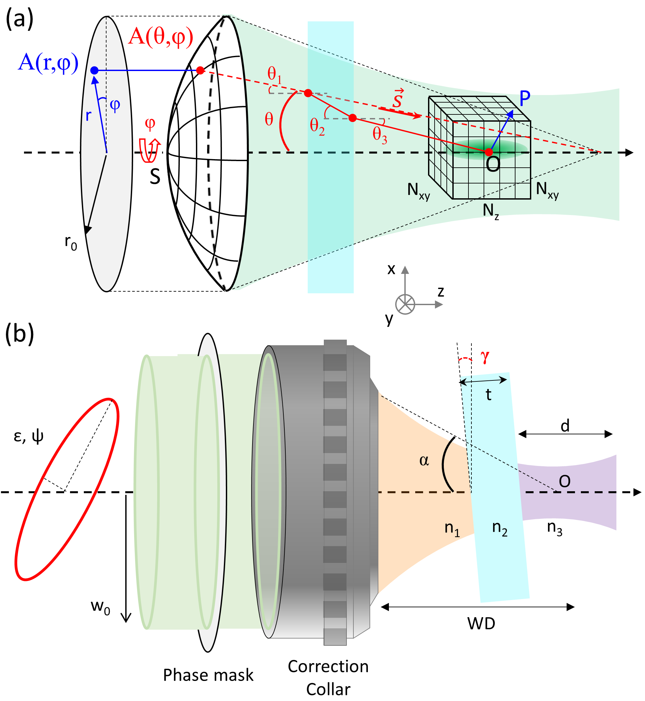

This is a brief introduction to the theoretical background of faser. For a more detailed explanation, please refer to the original publications.

## Light Distribution in the Focal Region

In optical imaging systems with a high numerical aperture (NA $ \geq 0.7 $), the approximations used in scalar diffraction theory—such as the paraxial approximation, Kirchhoff boundary condition, and Fresnel or Fraunhofer approximations—are no longer accurate [^1] .

During the 1950s, Richards and Wolf introduced a detailed mathematical framework to describe the electromagnetic (EM) field distribution in the focal region of a high NA objective lens [^2] [^3]. **The validity of this integral representation has been rigorously examined in subsequent studies** [^4] [^5]. The main assumptions underlying this theory are as follows:

- The beam exiting the pupil has a spherical wavefront with a radius equal to the objective's focal length, $f$.
- Each diffracted ray is modeled as a plane wave propagating toward the lens's geometrical focal point, represented by the wave vector $\mathbf{k}$. 
- **The observation point is significantly distant from the exit pupil** ($SP \gg \lambda$, see Fig. 1a), **and the pupil diameter is much larger than the wavelength** ($f \sin \alpha \gg \lambda$).

This framework, known as vectorial diffraction theory, expresses the electric field $\mathbf{E}$ at any point $\mathrm{P}(x, y, z)$ in the focal region as a superposition of plane waves diffracted from the exit pupil over a solid angle $\Omega$ [^3][^1][^6]:

$\mathbf{E}(x, y, z) = -\frac{ikf}{2\pi} \iint_{\Omega} \frac{a(s_x, s_y)}{s_z} e^{ik\mathbf{s}\cdot\mathbf{r}} \, ds_x \, ds_y$

Here, $k$ is the wavenumber, $\mathbf{s} = (s_x, s_y, s_z)$ is a unit vector describing the direction of each ray from the objective pupil to the focal point $O$, $a$ represents the complex amplitude of the beam after passing through the objective, and $\mathbf{r}$ is the position vector for point $\mathrm{P}(x, y, z)$. To simplify analysis, the wave vector $\mathbf{s}$ and pupil function are expressed in spherical coordinates:

$\mathbf{s} = (s_x, s_y, s_z) = (\sin\theta \cos\varphi, \sin\theta \sin\varphi, \cos\theta), \quad d\Omega = \frac{ds_x \, ds_y}{s_z} = \sin\theta \, d\theta \, d\varphi$

Using the geometry shown in Fig. 1, the diffraction integral is given by:

$\mathbf{E^{(1)}}(x, y, z) = -\frac{ik_0f}{2\pi} \int_0^\alpha \int_0^{2\pi} \mathbf{\Lambda^{(1)}}(\theta, \varphi) \mathbf{A^{(0)}}(\theta, \varphi) e^{ik_0n(x \sin\theta \cos\varphi + y \sin\theta \sin\varphi + z \cos\theta)} \sin\theta \, d\theta \, d\varphi$

In this expression, $k_0$ is the wavenumber in vacuum, $n$ is the refractive index of the medium, $\alpha = \arcsin (\mathrm{NA}/n)$ is the semi-aperture angle of the objective, and $\mathbf{\Lambda^{(1)}}(\theta, \varphi)$ is an operator that transforms the incident complex vector field $\mathbf{A^{(0)}}(\theta, \varphi)$ at the objective’s back aperture into the field $\mathbf{A^{(1)}}(\theta, \varphi)$ over $\Omega$. 

---

###### Figure 1. Schematic of the geometry used for simulations:
1. **(a)** In vectorial diffraction theory, the incident pupil field $A(r, \varphi)$ is transformed into a spherical wavefront by the objective lens, which then propagates to the focal point. The intensity at any point $P$ near the focus $O$ is computed, considering propagation through stratified media (e.g., immersion liquid, coverslip, and sample). 
2. **(b)** Beam properties, including ellipticity, intensity profiles, and potential aberrations, are characterized before the objective lens. A phase mask can also be introduced, particularly for beam shaping in applications like STED microscopy.

---

[^1]: Gu, M. (2000). Advanced optical imaging theory. *Springer Science*.
[^2]: Richards, B. (1959). "Electromagnetic diffraction in optical systems, I. An integral representation of the image field." *Proceedings of the Royal Society A*.
[^3]: Wolf, E. (1959). "Electromagnetic diffraction in optical systems, II. Structure of the image field in an aplanatic system" *Proceedings of the Royal Society A*.
[^4]: Foreman, M. R., & et al. (2011).  Computational methods in vectorial imaging *Journal of Modern Optics*.
[^5]: Leutenegger, M. (2006). Fast focus field calculations *Optics Express*.
[^6]: Török, P., & et al. (1995). Electromagnetic diffraction of light focused through a planar interface between materials of mismatched refractive indices: an integral representation *Optical Society of America*
